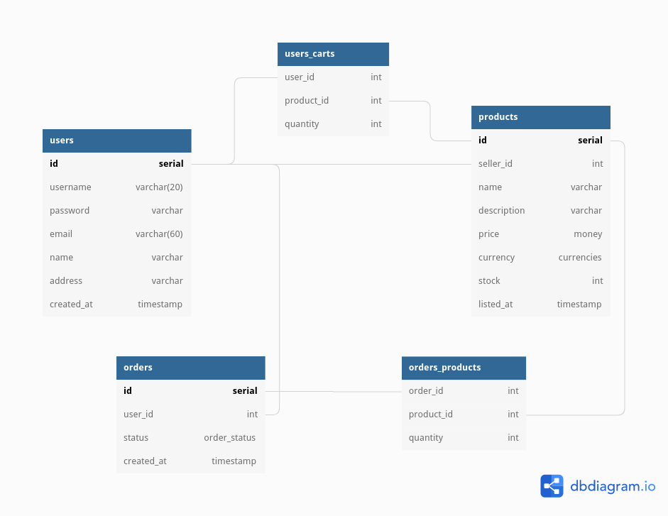

# epstore

NodeJS + ExpressJS + PostgreSQL eCommerce platform for buying and selling
items. This project is the backend server code for interacting with the
database through an API.

This is just an MVP project and is not intended for use in a production
environment. Please send any feature requests / bug reports, and I will try to
address them. I do aim to rewrite this project and make it into a viable
product so any feedback is appreciated.

## TODO

- Order status
  - ~~Allow owners of products to see all orders including their products -
    but not the details of anything else in the order they are not the owner
    of~~
  - Implement triggers to update order status to `part-shipped` or `shipped`
    depending on how many items have been marked as shipped
  - Implement simular triggers for when it is marked as `delivered`/`fulfilled`
- User roles
  - Implement ability for `admin` users to view details on all users and orders
  - Implement ability for `admin` and `moderator` users to remove products
  - Allow `admin` users to promote `general` users to `moderator` status
- Tests
  - Implement unit tests to cover all database interactions and routes
- Documentation
  - Create an OpenAPI 3.0 YAML specification outlining the APIs functionality,
    usage and responses with Swagger

## Install and Run

This project has only been tested using PostgreSQL 14.4 with Node v18.0.0.

First clone the repo and install the dependencies:

```sh
git clone https://github.com/h5law/epstore.git
cd epstore
npm i
```

You will need to initialise a PostgreSQL database locally, create a user and
give it a password and then create a database, then you can use the SQL file
provided to set up the tables using the command below.

```sh
psql -U <username> -d <database> -f eCommerce.sql -a
```

Finally create a `.env` file in the root directory and put in the following:

```javascript
DATABASE_URL='postgres://<user>:<password>@127.0.0.1:5432/<database>'
SESSION_SECRET='<RANDOM STRING>'
NODE_ENV='<development or production>'
```

By setting `NODE_ENV` to development you will get detailed logs on all
requests sent to the database.

Then you can run `npm start` and begin to interact
with the API, as long as your PostgreSQL database is running.

## Database

The database behind this project is designed according to this entity
relationship diagram


