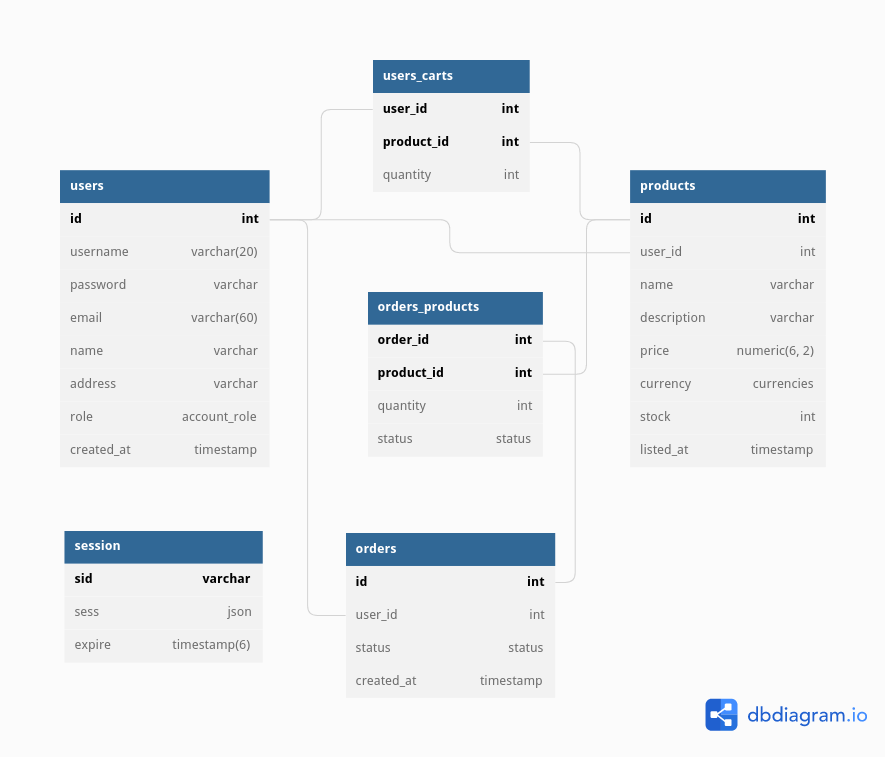

# epstore

NodeJS + ExpressJS + PostgreSQL eCommerce platform for buying and selling
items. This project is the backend server code for interacting with the
database through an API.

Currently the server can handle: user registration, sessions, account deletion
and account details updates; listing and querying all products, posting and
updating products and deleting them; creating, updating and clearing carts,
viewing, and cancelling orders, checking out from cart or checking out a
single product. Vendors can see all orders made against their products and
have the ability to mark the individual products as shipped or the entire
order if they own all the products in the order.

Sessions are stored persistently in the sessions table of the database and
removed after their expiration date.

This is just an MVP project and is not intended for use in a production
environment. Please send any feature requests / bug reports, and I will try to
address them. I do aim to rewrite this project and make it into a viable
product so any feedback is appreciated.

## TODO

- Order status
  - ~~Allow owners of products to see all orders including their products -
    but not the details of anything else in the order they are not the owner
    of~~
  - ~~Implement triggers to update order status from `pending` to `shipped`
    depending on how many items have been marked as shipped~~
  - Implement `disputed` order status functionality
- User roles
  - Implement ability for `admin` users to view details on all users and orders
  - Implement ability for `admin` users to remove any product
  - Implement ability for `admin` users to view and settle disputes
- Tests
  - ~~Implement unit tests for users endpoints~~
  - ~~Implement unit tests for products endpoints~~
  - Implement unit tests for carts endpoints
  - ~~Implement unit tests for orders endpoints~~
- Documentation
  - Create an OpenAPI 3.0 YAML specification outlining the APIs functionality,
    usage and responses with Swagger

## Install and Run

This project has only been tested using PostgreSQL 14.4 with Node v18.0.0.

First clone the repo and install the dependencies:

```sh
git clone https://github.com/h5law/epstore.git
cd epstore
npm i
```

Make sure that your postgres instance is running

```sh
sudo systemctl start postgresql-14.service
```

You will need to initialise a PostgreSQL database locally, create a user and
give it a password and then create a database, then you can use the SQL file
provided to set up the tables using the command below.

```sh
psql -U <username> -d <database> -f eCommerce.sql -a
```

Finally create a `.env` file in the root directory and put in the following:

```javascript
DATABASE_URL='postgres://<user>:<password>@127.0.0.1:5432/<database>'
SESSION_SECRET='<RANDOM STRING>'
NODE_ENV='<development or production>'
```

By setting `NODE_ENV` to development you will get detailed logs on all
requests sent to the database. Production will hide these query logs. And all
logs are disabled when running tests.

Then you can run `npm start` and begin to interact
with the API, as long as your PostgreSQL database is running.

By running `npm prod` the server will launch in production mode and will not
give the detailed logs of database queries.

For Linux+systemd users the file `setup.sh` will do the initial setup
automatically. It requires PostgreSQL 14.4 to be installed and running but
will initiate the database - run the tests and then re-initiate the database
for a clean start.

## Database

The database behind this project is designed according to this entity
relationship diagram



## Tests

You can run the current test suite with `npm test` - make sure that postgres is
running first and initialised with the `eCommerce.sql` file beforehand. Or use
the `setup.sh` script to automatically initiate the database, run the tests
and re-initialise the database once done.

The test suite may return errors if the database has already been used
(products are already listed) - so it is better to run the tests before using
the database and then re-initialising the database after for a clean slate.
The test suite will clean up all users/products/orders that it creates but if
not re-initialised the primary keys (users.id, products.id, orders.id, etc.)
will not start at 1.
